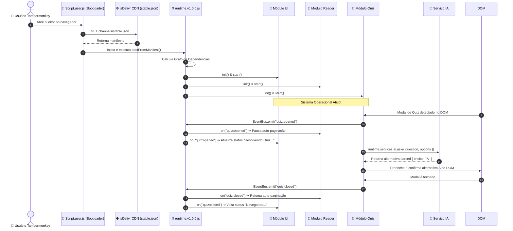
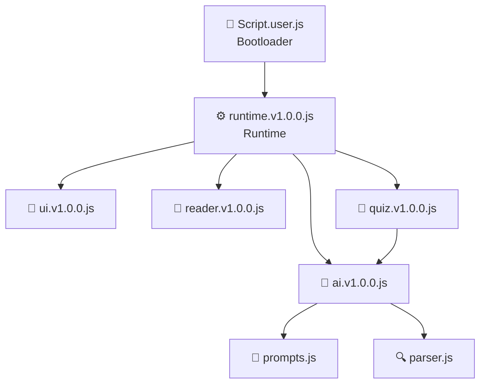

# Elefante Letrado Script — Visão Geral da Arquitetura

> Documento gerado ao término da **Fase 6** de migração arquitetural.
> A arquitetura evoluiu de um Userscript monolítico (~1.191 linhas) para uma plataforma modular profissional baseada em plugins.

---

## 🗺️ Fluxo de Execução — Diagrama Completo



---

## 🏗️ Estrutura dos Repositórios

### Repositório Principal — Produto
> `github.com/Dezin-fx/Elefante-Letrado-Script`

```
Elefante-Letrado-Script/
├── Script.js              ← Monolito original (preservado, Strangler Pattern)
└── Script.user.js         ← Bootloader oficial (~60 linhas)
```

O `Script.user.js` é o único arquivo instalado pelo usuário final via Tampermonkey.
Ele busca o manifesto e delega todo o resto ao Runtime modular.

---

### Repositório Secundário — Distribuição
> `github.com/Dezin-fx/Elefante-Letrado-Script-Releases`

```
Elefante-Letrado-Script-Releases/
│
├── channels/
│   └── stable.json              ← Manifesto do canal estável
│
├── schemas/
│   └── manifest.schema.json     ← Esquema JSON de validação
│
├── runtime/
│   └── runtime.v1.0.0.js        ← Sistema Operacional dos módulos
│
└── modules/
    ├── ui/
    │   ├── ui.v1.0.0.js         ← Módulo de Apresentação
    │   ├── icons.js             ← SVG Icons
    │   └── styles.js            ← CSS Injector
    │
    ├── reader/
    │   └── reader.v1.0.0.js     ← Módulo de Auto-Paginação
    │
    ├── ai/
    │   ├── ai.v1.0.0.js         ← Módulo de IA / OpenRouter
    │   ├── prompts.js           ← Construtores de Prompt
    │   └── parser.js            ← Parser de respostas da IA
    │
    └── quiz/
        └── quiz.v1.0.0.js       ← Módulo de Resolução de Quiz
```

---

## 🔗 Grafo de Dependências dos Módulos



---

## 🛡️ Princípios Arquiteturais Adotados

### 1. Nenhum Módulo Importa Outro Módulo Diretamente
Toda comunicação entre módulos ocorre via **EventBus** do Runtime.
Isso evita que a arquitetura modular vire um "monolito dividido em arquivos".

```
❌ quiz.js importa ai.js diretamente
✅ quiz.js chama runtime.services.ai.ask() — o AI pode ser trocado sem alterar o Quiz
```

### 2. Separação Total por Responsabilidade

| Módulo | Responsabilidade | O que NÃO pode fazer |
| :--- | :--- | :--- |
| **UI** | Desenhar painel, capturar cliques | Temporizadores, chamadas de rede, lógica de negócio |
| **Reader** | Auto-paginação com `ArrowRight` | Manipulação de DOM visual, chamadas de rede |
| **AI** | Conexão HTTP com OpenRouter | Queries DOM, conhecer Quiz ou UI |
| **Quiz** | Observar DOM, extrair questões, preencher respostas | Lógica de IA, gerenciar paginação |

### 3. EventBus: Eventos de Domínio vs. Comandos de Ação

```
Domain Events (estado que mudou):   quiz:opened, quiz:closed, reader:started, ai:request:success
Commands (intenção do usuário):     command:reader:start, command:reader:stop
```

### 4. Bootloader Enxuto
O script instalado pelo usuário tem apenas **uma responsabilidade**: buscar o manifesto e injetar o Runtime. Novas funcionalidades chegam pelo CDN sem re-instalação.

### 5. Fault Isolation no Runtime
Módulos com falha ficam no estado `FAILED` ou `BLOCKED` (se dependem de um módulo falho) sem derrubar o sistema inteiro.

---

## 📅 Histórico de Fases

| Fase | O que foi feito |
| :--- | :--- |
| **0 — Documentação** | `README.md`, `PLANO_DE_MODULARIZACAO.md`, `ARCHITECTURE_DECISIONS.md`, `MODULE_CONTRACTS.md`, `manifest.spec.md` |
| **1 — POC** | `runtime-v2-poc.js`, `mock-modules.js`, `runner.js` — Prova de conceito validada em Node.js |
| **2 — Repositório de Releases** | Estrutura de pastas, `schemas/`, `channels/`, `README.md` |
| **3 — Runtime Oficial** | `runtime/runtime.v1.0.0.js` com Topological Sort, Fault Isolation e Service Proxies |
| **4 — Módulo UI** | `modules/ui/` — ui, icons e styles totalmente desacoplados |
| **5 — Módulo Reader** | `modules/reader/reader.v1.0.0.js` com auto-pausa/retomada via eventos |
| **6 — Módulo AI** | `modules/ai/` — ai, prompts e parser encapsulando OpenRouter |
| **7 — Módulo Quiz** | `modules/quiz/quiz.v1.0.0.js` com MutationObserver debounced e integração via serviço AI |
| **8 — Bootloader Oficial** | `-Letrado-Script/Script.user.js` — ponto de entrada final |
